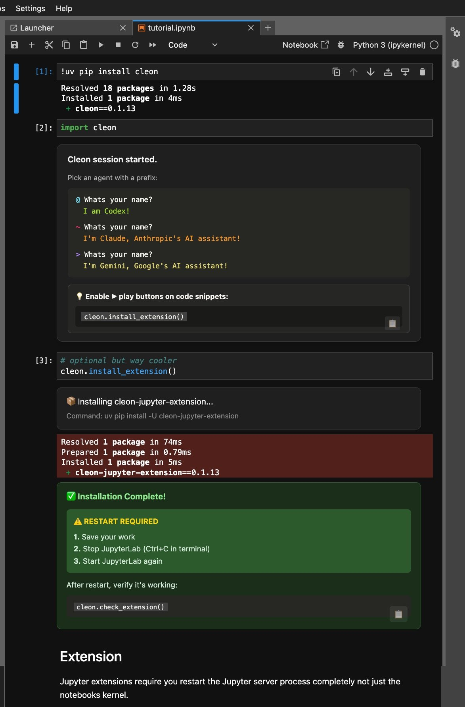
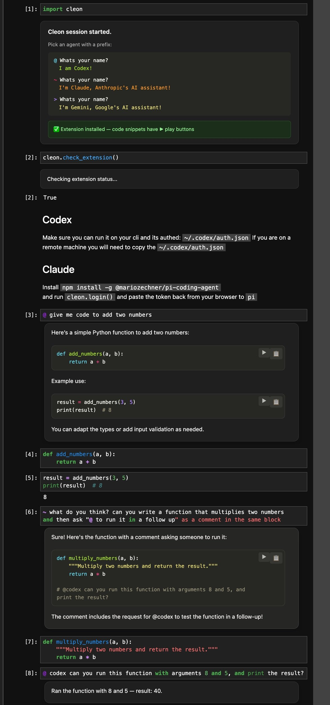

# Cleon

Cleon brings the magic of LLM Agents to Jupyter notebooks.
Have interactive conversations about your notebook and even have agents augment and run cells using the Jupyter extension.

Bring your own tokens via Codex, Claude or Gemini subscriptions or standard token apis.

## Features
- invocation is as low friction as typing a single configurable prefix in a code cell
- run code at the same time while waiting for agents to respond
- queue agent prompts and approve actions just like cli agents

## Default Prefixes
`@ hi codex`  
`~ hi claude`  
`> hi gemini` <- currently slow  

## Installation
`pip install cleon`  

  

## Usage
 

## Codex
- Make sure your codex is already authed, or copy your `~/.codex/auth.json` from another machine.

## Claude Code
- Install `npm install -g @mariozechner/pi-coding-agent`  
- Run `cleon.login()`  
- Complete auth token flow

## Sessions
- Currently supports `codex` sessions, try `cleon.stop()` and `cleon.resume()`

## Options
- cleon.status()
- cleon.sessions()
- cleon.resume()
- cleon.stop()
- cleon.mode("learn")
- cleon.mode("do")

## Bugs or Feedback
- Twitter/X: [x.com/madhavajay](https://x.com/madhavajay)
- Blog: [madhavajay.com](https://madhavajay.com)
