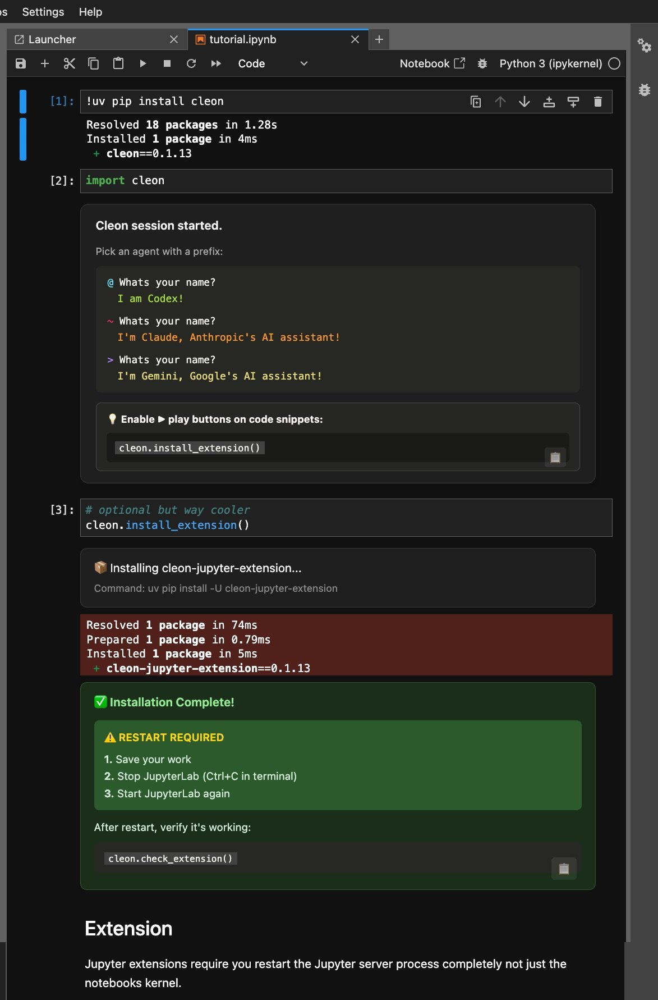
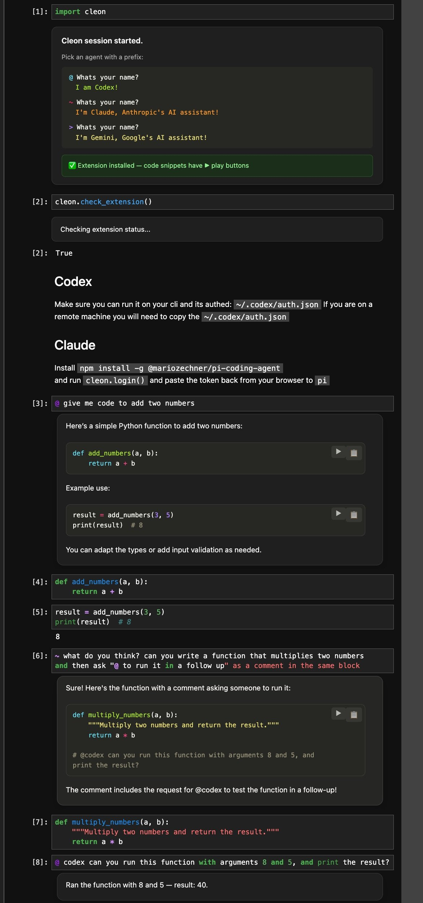

[](https://pypi.org/project/cleon/)
[](https://pypistats.org/packages/cleon)
[](https://pypi.org/project/cleon/)
[](https://pypi.org/project/cleon/)

# Cleon


Cleon brings the magic of LLM Agents to Jupyter notebooks.
Have interactive conversations about your notebook and even have agents augment and run cells using the Jupyter extension.

Bring your own tokens via Codex, Claude or Gemini subscriptions or standard API keys.

## Features
- Invocation is as low friction as typing a single configurable prefix in a code cell
- Run code at the same time while waiting for agents to respond
- Queue agent prompts and approve actions just like CLI agents
- Unified backend for all providers (Codex, Claude, Gemini) via pi-mono-rust

## Default Prefixes
`: hi codex`
`~ hi claude`
`> hi gemini`

## Installation

### Default (extension included, no Jupyter)
`pip install cleon`

This installs the Python magics and backend plus the prebuilt Cleon extension package, but does not pull in JupyterLab itself (so it won't reinstall Jupyter if you already have it).

Launch with the bundled helper (creates/uses `~/.cache/cleon/jupyter-env`):

```
cleon jupyter lab
```

You can also run `cleon jupyter notebook` if you prefer the classic UI.

The launcher will install JupyterLab + the Cleon extension into its managed env if they're missing. If you install the Cleon Jupyter extension while Jupyter is running, restart Jupyter (and refresh the browser) so the extension loads.

### Full install into your current env
`pip install "cleon[jupyter]"`

This pulls in JupyterLab 4+ and the prebuilt Cleon extension into your active environment.

### Minimal install
Need to skip Jupyter/extension? Install without deps and add only what you want:

```
pip install --no-deps cleon
```

There is a placeholder extra `cleon[no-jupyter]`, but it's a no-op; use `--no-deps` for a truly lean install.




## Usage



## Authentication

All providers use a unified authentication system. Credentials are stored in `~/.pi/agent/auth.json`.

### Codex (OpenAI)
Run `cleon.login("codex")` and complete the OAuth flow, or set `OPENAI_API_KEY` environment variable.

### Claude (Anthropic)
Run `cleon.login("claude")` and complete the OAuth flow (requires Claude Pro/Max subscription), or set `ANTHROPIC_API_KEY` environment variable.

### Gemini (Google)
Set up credentials via Google Cloud or the Gemini CLI, or set `GOOGLE_API_KEY` environment variable.

## Sessions
All providers support session persistence. Try:
- `cleon.stop()` - Stop the current session and save state
- `cleon.resume()` - Resume the last session

## Options
- `cleon.status()` - Show current session status
- `cleon.sessions()` - List available sessions
- `cleon.resume()` - Resume a previous session
- `cleon.stop()` - Stop the current session
- `cleon.mode("learn")` - Set mode to learning
- `cleon.mode("do")` - Set mode to execution
- `cleon.login("codex")` or `cleon.login("claude")` - Authenticate with a provider

## Architecture

Cleon uses a unified backend (`PiMonoBackend`) powered by pi-mono-rust for all providers:

```
Cleon (Python)
├── backend.py
│   └── PiMonoBackend (unified backend)
│       └── pi_mono.AgentSession (PyO3)
├── magic.py (Jupyter integration)
├── oauth.py (login via pi_mono OAuth)
└── __init__.py (public API)

pi-mono-rust (Rust library)
├── AgentSession (session management)
├── AuthStorage (credential storage)
├── StreamEventEmitter (event streaming)
└── PyO3 bindings
```

## Bugs or Feedback
- Twitter/X: [x.com/madhavajay](https://x.com/madhavajay)
- Blog: [madhavajay.com](https://madhavajay.com)
